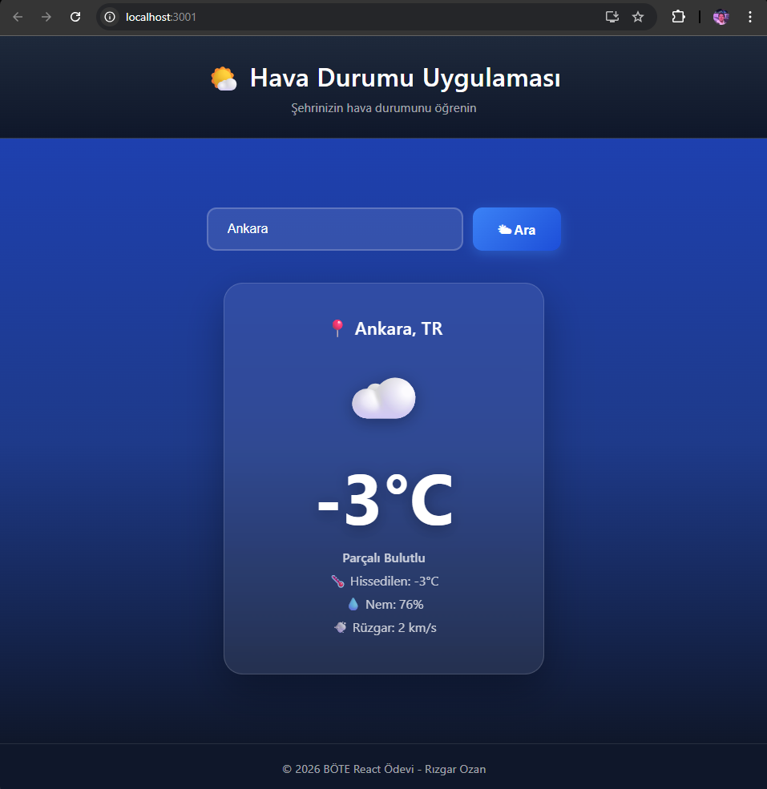

# Hava Durumu Uygulaması

Bu proje, React kullanılarak geliştirilmiş bir hava durumu uygulamasıdır. Kullanıcıların aradığı şehirlerin anlık hava durumu bilgilerini gösterir.

## Kullanılan API

Bu projede hava durumu verilerini çekmek için [OpenWeatherMap API](https://openweathermap.org/api) kullanılmıştır.

API Endpoint: `https://api.openweathermap.org/data/2.5/weather`

## Projenin Çalıştırılması

Projeyi yerel ortamınızda çalıştırmak için aşağıdaki adımları izleyin:

1.  Projeyi klonlayın veya indirin.
2.  Proje dizinine gidin:
    ```bash
    cd hava-durumu-odevi
    ```
3.  Gerekli bağımlılıkları yükleyin:
    ```bash
    npm install
    ```
4.  Uygulamayı başlatın:
    ```bash
    npm start
    ```

Uygulama tarayıcınızda `http://localhost:3001` adresinde çalışacaktır.

## Ekran Görüntüsü


